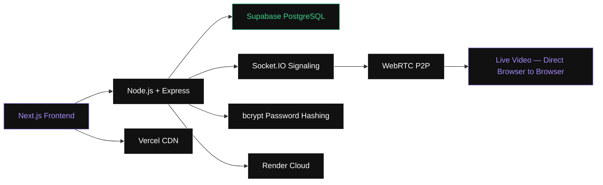
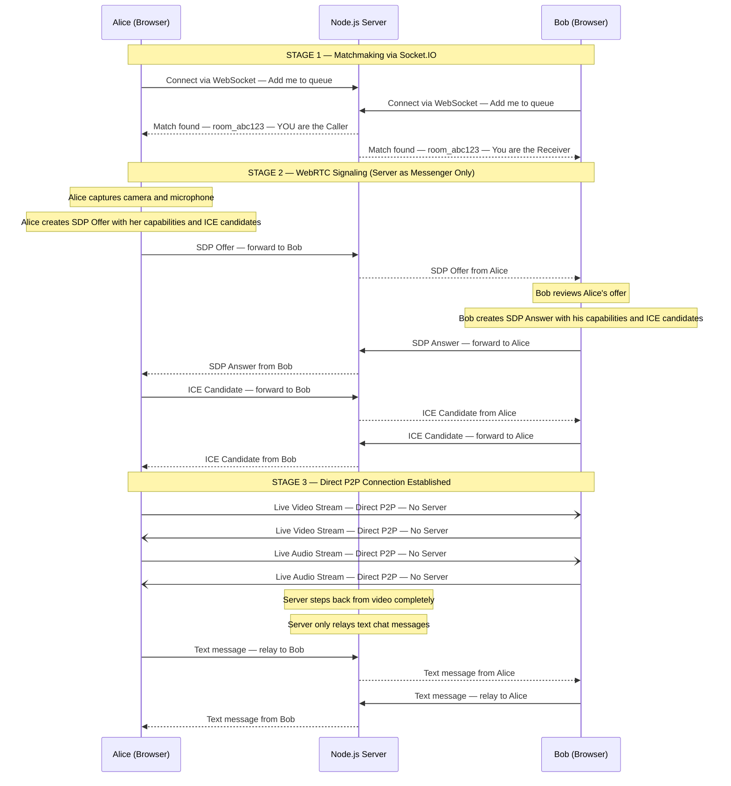
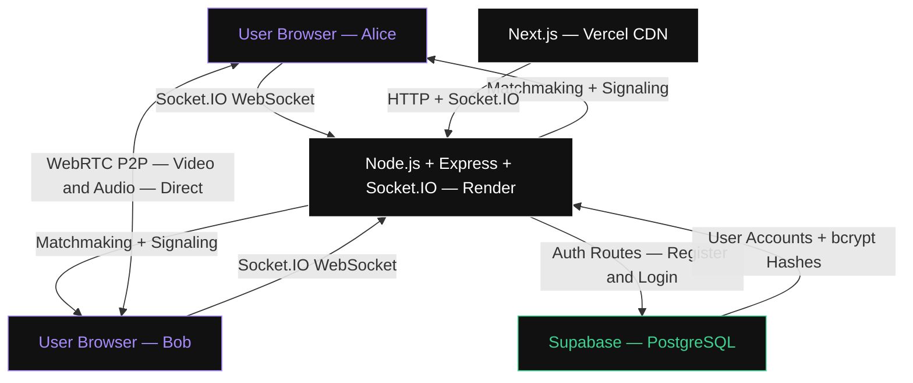
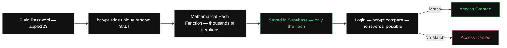
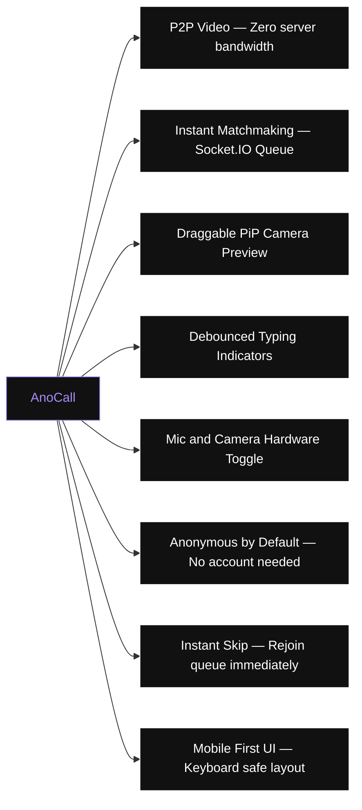

# Ano**Call.**

### 🔒 Full Stack &nbsp;·&nbsp; WebRTC &nbsp;·&nbsp; Real-Time &nbsp;·&nbsp; Anonymous

**A production-grade anonymous video chat platform — strangers connect instantly, video streams peer-to-peer directly between browsers, and zero media ever passes through the server.**

Think Omegle — but rebuilt from scratch with modern, secure, scalable technology.

---

## ✨ Features

| Feature | Description |
|---|---|
| 📹 **P2P Video** | Zero server bandwidth. Direct browser-to-browser via WebRTC. |
| ⚡ **Instant Match** | Socket.IO queue pairs strangers in milliseconds. |
| 🛡️ **bcrypt Auth** | Passwords salted and hashed. Never stored plain. |
| 📱 **Mobile First** | Keyboard-safe layout. Draggable Picture-in-Picture preview. |
| 🕵️ **Anonymous** | No account needed. Core chat is always anonymous. |
| ⏭️ **Instant Skip** | Hit Next — disconnect and re-queue immediately. |

---

## 🏆 AnoCall vs The Competition

| Feature | AnoCall | Omegle | Chatroulette |
|---|:---:|:---:|:---:|
| Video passes through server | ✅ Never | ❌ Yes | ❌ Yes |
| Passwords bcrypt hashed | ✅ | ❓ | ❓ |
| Mobile-first UI | ✅ | ❌ | ❌ |
| Open source / Modern stack | ✅ | ❌ | ❌ |
| Draggable PiP + Typing Indicator | ✅ | ❌ | ❌ |

---

## 🛠️ Why Each Technology Was Chosen

### ⚛️ Next.js — Frontend
Server-side rendering ensures the app loads instantly on any device. Component-based architecture makes the real-time chat UI clean and maintainable. Vercel deploys it globally with zero config.

### 🟢 Node.js + Express — Backend
Non-blocking I/O handles thousands of concurrent WebSocket connections efficiently. Perfect for real-time apps where hundreds of users are connected simultaneously without blocking each other.

### 🔌 Socket.IO — Real-Time Signaling
Unlike HTTP where every request opens and closes a connection, Socket.IO keeps a persistent WebSocket alive — enabling the server to push matchmaking events, relay WebRTC offers, and deliver text messages instantly with no polling.

### 📡 WebRTC — Video Streaming
Built directly into every modern browser. Enables peer-to-peer video with no server in the middle — zero bandwidth cost for video, lower latency, and the server literally cannot record you even if it wanted to.

### 🗄️ Supabase — Database
Fully managed PostgreSQL with auto-backups, a great dashboard, and instant setup. Chosen over Firebase for its open-source nature and familiar SQL queries. Stores only user accounts and bcrypt hashes — never video data.

### 🔐 bcrypt — Password Security
Industry-standard one-way hashing with unique salts per user. Intentionally slow — a hacker can only check ~3 hashes/second vs billions with weak algorithms. A 12-character password would take longer than the age of the universe to crack.

---

## 🗺️ Tech Stack Overview

```mermaid
graph LR
    FE["Next.js Frontend"] --> BE["Node.js + Express"]
    BE --> DB["Supabase PostgreSQL"]
    BE --> SIO["Socket.IO Signaling"]
    SIO --> WR["WebRTC P2P"]
    WR --> V["Live Video — Direct Browser to Browser"]
    BE --> BC["bcrypt Password Hashing"]
    FE --> VL["Vercel CDN"]
    BE --> RD["Render Cloud"]

    style FE fill:#111,stroke:#a78bfa,color:#a78bfa
    style BE fill:#111,stroke:#fff,color:#fff
    style DB fill:#111,stroke:#3FCF8E,color:#3FCF8E
    style SIO fill:#111,stroke:#fff,color:#fff
    style WR fill:#111,stroke:#fff,color:#fff
    style V fill:#111,stroke:#a78bfa,color:#a78bfa
    style BC fill:#111,stroke:#fff,color:#fff
    style VL fill:#111,stroke:#fff,color:#fff
    style RD fill:#111,stroke:#fff,color:#fff
```

---

## 🔄 Full WebRTC Connection Handshake — Step by Step

```mermaid
sequenceDiagram
    participant Alice as Alice (Browser)
    participant Server as Node.js Server
    participant Bob as Bob (Browser)

    Note over Alice,Bob: STAGE 1 — Matchmaking via Socket.IO
    Alice->>Server: Connect via WebSocket — Add me to queue
    Bob->>Server: Connect via WebSocket — Add me to queue
    Server-->>Alice: Match found — room_abc123 — YOU are the Caller
    Server-->>Bob: Match found — room_abc123 — You are the Receiver

    Note over Alice,Bob: STAGE 2 — WebRTC Signaling (Server as Messenger Only)
    Note over Alice: Alice captures camera and microphone
    Note over Alice: Alice creates SDP Offer with her capabilities and ICE candidates
    Alice->>Server: SDP Offer — forward to Bob
    Server-->>Bob: SDP Offer from Alice
    Note over Bob: Bob reviews Alice's offer
    Note over Bob: Bob creates SDP Answer with his capabilities and ICE candidates
    Bob->>Server: SDP Answer — forward to Alice
    Server-->>Alice: SDP Answer from Bob
    Alice->>Server: ICE Candidate — forward to Bob
    Server-->>Bob: ICE Candidate from Alice
    Bob->>Server: ICE Candidate — forward to Alice
    Server-->>Alice: ICE Candidate from Bob

    Note over Alice,Bob: STAGE 3 — Direct P2P Connection Established
    Alice-)Bob: Live Video Stream — Direct P2P — No Server
    Bob-)Alice: Live Video Stream — Direct P2P — No Server
    Alice-)Bob: Live Audio Stream — Direct P2P — No Server
    Bob-)Alice: Live Audio Stream — Direct P2P — No Server
    Note over Server: Server steps back from video completely
    Note over Server: Server only relays text chat messages
    Alice->>Server: Text message — relay to Bob
    Server-->>Bob: Text message from Alice
    Bob->>Server: Text message — relay to Alice
    Server-->>Alice: Text message from Bob
```

---

## 🏗️ Architecture Overview

```mermaid
graph TD
    U1["User Browser — Alice"] -->|Socket.IO WebSocket| SRV["Node.js + Express + Socket.IO — Render"]
    U2["User Browser — Bob"] -->|Socket.IO WebSocket| SRV
    SRV -->|Matchmaking + Signaling| U1
    SRV -->|Matchmaking + Signaling| U2
    U1 <-->|WebRTC P2P — Video and Audio — Direct| U2
    SRV -->|Auth Routes — Register and Login| DB["Supabase — PostgreSQL"]
    DB -->|User Accounts + bcrypt Hashes| SRV
    FE["Next.js — Vercel CDN"] -->|HTTP + Socket.IO| SRV

    style U1 fill:#111,stroke:#a78bfa,color:#a78bfa
    style U2 fill:#111,stroke:#a78bfa,color:#a78bfa
    style SRV fill:#111,stroke:#fff,color:#fff
    style DB fill:#111,stroke:#3FCF8E,color:#3FCF8E
    style FE fill:#111,stroke:#fff,color:#fff
```

---

## 🔐 bcrypt Password Security Flow

```mermaid
graph LR
    PW["Plain Password — apple123"] --> SALT["bcrypt adds unique random SALT"]
    SALT --> HASH["Mathematical Hash Function — thousands of iterations"]
    HASH --> DB["Stored in Supabase — only the hash"]
    DB --> CHK["Login — bcrypt.compare — no reversal possible"]
    CHK -->|Match| OK["Access Granted"]
    CHK -->|No Match| FAIL["Access Denied"]

    style PW fill:#111,stroke:#fff,color:#fff
    style SALT fill:#111,stroke:#fff,color:#fff
    style HASH fill:#111,stroke:#fff,color:#fff
    style DB fill:#111,stroke:#3FCF8E,color:#3FCF8E
    style CHK fill:#111,stroke:#fff,color:#fff
    style OK fill:#111,stroke:#4ade80,color:#4ade80
    style FAIL fill:#111,stroke:#f87171,color:#f87171
```

---

## ⭐ Key Features

```mermaid
graph LR
    AC["AnoCall"] --> F1["P2P Video — Zero server bandwidth"]
    AC --> F2["Instant Matchmaking — Socket.IO Queue"]
    AC --> F3["Draggable PiP Camera Preview"]
    AC --> F4["Debounced Typing Indicators"]
    AC --> F5["Mic and Camera Hardware Toggle"]
    AC --> F6["Anonymous by Default — No account needed"]
    AC --> F7["Instant Skip — Rejoin queue immediately"]
    AC --> F8["Mobile First UI — Keyboard safe layout"]

    style AC fill:#111,stroke:#a78bfa,color:#a78bfa
    style F1 fill:#111,stroke:#fff,color:#fff
    style F2 fill:#111,stroke:#fff,color:#fff
    style F3 fill:#111,stroke:#fff,color:#fff
    style F4 fill:#111,stroke:#fff,color:#fff
    style F5 fill:#111,stroke:#fff,color:#fff
    style F6 fill:#111,stroke:#fff,color:#fff
    style F7 fill:#111,stroke:#fff,color:#fff
    style F8 fill:#111,stroke:#fff,color:#fff
```

---

## 🚀 Deployment Architecture

| Layer | Platform | Details |
|---|---|---|
| 🌐 **Frontend** | **Vercel CDN** | Globally distributed. Zero-config Next.js. Auto-scaling. Users in India, US, Europe all get instant loads from a nearby edge node. |
| ☁️ **Backend** | **Render Cloud** | Persistent server process — critical for Socket.IO. Unlike serverless, the WebSocket connection stays alive continuously for all active users. |
| 🗄️ **Database** | **Supabase** | Managed PostgreSQL. Auto-backups, great dashboard, zero maintenance. Stores only user accounts and bcrypt hashes. Video data never touches it. |

---

## 🔗 Live Links

- 🌐 **Live App:** [anocall.vercel.app](https://anocall.vercel.app/)
- 💻 **GitHub:** [github.com/hemanthreddykunduru/anocall](https://github.com/hemanthreddykunduru/anocall)