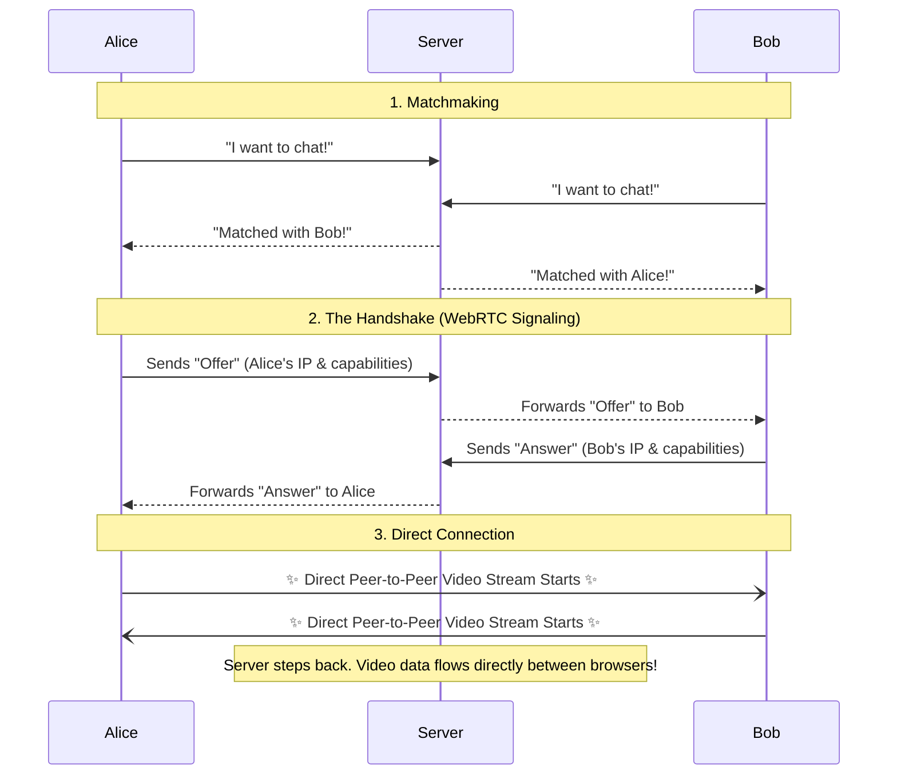

# Camcall - Private Anonymous Video Chat

Camcall is a modern, real-time video and text chatting application that connects you with random strangers securely and anonymously. Built with a focus on privacy, speed, and a premium mobile-first user experience.

## 🚀 Technologies Used & Why

*   **Frontend: Next.js (React)** - Chosen for its fast rendering, robust routing, and excellent developer experience when building interactive UIs.
*   **Backend: Node.js & Express** - A lightweight and highly scalable runtime, perfect for handling thousands of concurrent real-time connections.
*   **Signaling Server: Socket.IO** - Used for real-time, low-latency communication. It handles finding matches, sending text messages, and orchestrating the initial video connection.
*   **Media Streaming: WebRTC (Peer-to-Peer)** - The core engine for video and audio. WebRTC allows browsers to stream media directly to each other without passing the heavy video data through our servers, ensuring high quality and low cost.
*   **Database: Supabase (PostgreSQL)** - A powerful, secure database used to store registered user credentials.
*   **Security: bcrypt** - A proven cryptographic hashing algorithm used to securely store and protect user passwords.

---

## 🔒 Security: How Passwords Are Kept Safe

We care deeply about privacy. When a user creates an account, we **never store the actual password**. Instead, we use **`bcrypt`**.

### How it works:
1. When you enter a password (e.g., `apple123`), `bcrypt` adds a unique random string called a **"salt"** to it.
2. It then mathematically transforms this combination into a scrambled, irreversible string (a **"hash"**), like `$2b$10$wO3...`.
3. We only store this hash in our Supabase database.

### Why is it impossible to crack?
Because `bcrypt` is a **one-way function**. You cannot reverse the hash back into the password. Even if a hacker managed to steal our entire database, they would only see scrambled text. Furthermore, because of the "salt," even if two users have the exact same password, their stored hashes will look completely different! 

---

## 🌐 Networking: How Users Connect

The networking in Camcall happens in two distinct parts: **Client-Server (Signaling)** and **Peer-to-Peer (WebRTC)**.

### 1. Client-Server (The Matchmaker)
When you log in, your browser connects to our Node.js backend using **Socket.IO**. The server acts as a matchmaker. It puts you in a queue, finds another waiting user, and puts you both in a private virtual "room". The server is strictly used for matchmaking and sending text chat messages.

### 2. Peer-to-Peer / WebRTC (The Video Call)
**What is Peer-to-Peer (P2P)?**
Imagine you want to send a large physical package to a friend. 
*   **Server-based:** You mail the package to a central post office, and the post office delivers it to your friend. (Slow and expensive).
*   **Peer-to-Peer:** You drive directly to your friend's house and hand them the package perfectly. (Fast, direct, and free).

WebRTC is the P2P engine. For the video call, **your computer streams video directly to the stranger's computer**. Our server never sees, touches, or records your video.

---

## 📡 The Connection Process (The Handshake)

For two computers to connect directly (P2P), they first need to know how to find each other on the internet. Our Socket.IO server helps them exchange this "contact info" in a process called **Signaling**.

Here is a simple example of **Alice** connecting to **Bob**:

```mermaid
sequenceDiagram
    participant Alice
    participant Server
    participant Bob

    Note over Alice,Bob: 1. Matchmaking
    Alice->>Server: "I want to chat!"
    Bob->>Server: "I want to chat!"
    Server-->>Alice: "Matched with Bob!"
    Server-->>Bob: "Matched with Alice!"

    Note over Alice,Bob: 2. The Handshake (WebRTC Signaling)
    Alice->>Server: Sends "Offer" (Alice's IP & capabilities)
    Server-->>Bob: Forwards "Offer" to Bob
    Bob->>Server: Sends "Answer" (Bob's IP & capabilities)
    Server-->>Alice: Forwards "Answer" to Alice

    Note over Alice,Bob: 3. Direct Connection
    Alice-)Bob: ✨ Direct Peer-to-Peer Video Stream Starts ✨
    Bob-)Alice: ✨ Direct Peer-to-Peer Video Stream Starts ✨
    
    Note over Server: Server steps back. Video data flows directly between browsers!
```

---

## ✨ Features Highlights

*   **Premium Mobile UI:** A custom-built, responsive interface that locks the video area on mobile so your view never jerks around when the virtual keyboard pops up to type.
*   **WhatsApp-Style Video:** Drag your own local video preview around the screen or tap it to instantly swap views with the remote stranger.
*   **Real-Time Typing Indicator:** Using debounced Socket.IO events, you see animated jumping dots and "Stranger is typing..." precisely when they are drafting a message.
*   **Hardware Control:** Easily toggle your microphone and camera on or off at any time.

---

## 🚀 Deployment Overview

*   **Frontend (Next.js)** is designed to be easily deployed on incredibly fast CDN networks like **Vercel** or **Netlify**.
*   **Backend (Node.js)** can be hosted on platforms like **Render**, **Railway**, or **Heroku** to manage the active Socket.IO connections. 
*   **Database (Supabase)** operates perfectly in the cloud independently.
