<div align="center">

# 🔐 AnoCall — Private Anonymous Video Chat

### **Live App → [anocall.vercel.app](https://anocall.vercel.app/)**

[](https://nextjs.org/)
[](https://nodejs.org/)
[](https://socket.io/)
[](https://webrtc.org/)
[](https://supabase.com/)
[](https://vercel.com/)

**AnoCall is a modern, real-time video and text chat application that connects you with random strangers — securely, anonymously, and privately. Built with a mobile-first mindset and zero video data ever touching our servers.**

</div>

---

## 📚 Table of Contents

1. [What Is This Project?](#-what-is-this-project)
2. [Tech Stack & Why We Chose Each Technology](#-tech-stack--why-we-chose-each-technology)
3. [Project Architecture — The Big Picture](#-project-architecture--the-big-picture)
4. [How Networking Works](#-how-networking-works)
   - [Part 1: Client–Server (The Matchmaker)](#part-1-clientserver-the-matchmaker)
   - [Part 2: Peer-to-Peer Video (WebRTC)](#part-2-peer-to-peer-video-webrtc)
5. [The Full Connection Handshake (Step-by-Step)](#-the-full-connection-handshake-step-by-step)
6. [Security: How Passwords Are Stored & Protected](#-security-how-passwords-are-stored--protected)
7. [Feature Highlights](#-feature-highlights)
8. [Deployment Overview](#-deployment-overview)
9. [Environment Variables](#-environment-variables)
10. [Getting Started (Local Development)](#-getting-started-local-development)

---

## 🤔 What Is This Project?

AnoCall lets two strangers on the internet video chat in real time — anonymously. Think of it like Omegle, but built with modern, production-grade technology and a focus on:

- **Privacy** — Your video stream never passes through our servers. It goes directly from your browser to the stranger's browser.
- **Security** — Passwords are never stored in plain text. Ever.
- **Speed** — WebRTC peer-to-peer streaming is as fast as it physically gets.
- **Mobile-First UI** — The entire interface is designed to feel native on a phone.

---

## 🛠 Tech Stack & Why We Chose Each Technology

| Technology | Role | Why We Chose It |
|---|---|---|
| **Next.js (React)** | Frontend | Server-side rendering, fast page loads, great routing, and a component-based UI perfect for a real-time app |
| **Node.js + Express** | Backend Server | Handles thousands of concurrent connections efficiently with non-blocking I/O — ideal for real-time apps |
| **Socket.IO** | Real-Time Signaling | Provides a reliable WebSocket layer for matchmaking, chat messages, and coordinating the video handshake |
| **WebRTC** | Video & Audio Streaming | Enables direct browser-to-browser video streaming — no server in the middle, no bandwidth cost, maximum quality |
| **Supabase (PostgreSQL)** | Database | A fully managed, scalable Postgres database. Easy to set up, with a great dashboard and built-in auth support |
| **bcrypt** | Password Hashing | The industry-standard algorithm for one-way, salted password hashing. Makes stored passwords practically impossible to crack |
| **Vercel** | Frontend Deployment | Globally distributed CDN with zero-config Next.js deployment. The site loads instantly from anywhere in the world |
| **Render** | Backend Deployment | A modern cloud platform built to run persistent Node.js/Socket.IO servers with support for WebSockets |

---

## 🏗 Project Architecture — The Big Picture

Before diving in deep, here is a high-level view of how all the pieces fit together:

```
┌─────────────────────────────────────────────────────────────────┐
│                        USER'S BROWSER                           │
│                                                                 │
│  ┌────────────────┐          ┌──────────────────────────────┐  │
│  │  Next.js (UI)  │          │  WebRTC Engine (Video/Audio) │  │
│  └────────┬───────┘          └──────────────┬───────────────┘  │
│           │ HTTP / Socket.IO                │  P2P Media Stream │
└───────────┼─────────────────────────────────┼──────────────────┘
            │                                 │
            ▼                                 ▼
┌───────────────────────┐         ┌────────────────────────────┐
│  Node.js + Express    │         │   STRANGER'S BROWSER       │
│  + Socket.IO Server   │◄───────►│   (Another WebRTC Client)  │
│                       │         └────────────────────────────┘
│  - Matchmaking Queue  │
│  - Signaling (Offers/ │◄──────► Supabase (PostgreSQL)
│    Answers/ICE)       │         - Stores user accounts
│  - Text Chat relay    │         - Encrypted password hashes
└───────────────────────┘
```

**The key insight:** The server handles **coordination** (who connects to who, text messages) but **never handles video**. Video flows directly browser-to-browser.

---

## 🌐 How Networking Works

The app uses two completely different types of networking working together. Understanding both is the key to understanding the whole project.

---

### Part 1: Client–Server (The Matchmaker)

When you open the app and click "Start Chatting", your browser establishes a persistent **WebSocket** connection to our Node.js server using **Socket.IO**.

> **What is a WebSocket?**
> Normal HTTP is like sending a letter — you send a request, the server sends a reply, and the conversation ends. A WebSocket is like a phone call — the connection stays open, and both sides can send messages at any time without a new request. This is what makes "real-time" possible.

The server maintains a **waiting queue**. Here's what happens step by step:

1. **You connect** → Server adds your socket ID to the waiting queue.
2. **A stranger connects** → Server finds you in the queue, pairs you both.
3. **Server creates a private "room"** → Both of you are placed in this virtual room using a unique room ID (e.g., `room_abc123`).
4. **Text messages** → When you type a message, it goes: `Your Browser → Server → Stranger's Browser`. The server relays it.

> **Why relay text through the server but not video?**
> Text messages are tiny (a few bytes). Relaying them through a server is cheap and simple. Video streams are massive (megabytes per second). Routing video through a server would cost a fortune and add unnecessary lag. That's why video uses a different technology entirely — WebRTC.

---

### Part 2: Peer-to-Peer Video (WebRTC)

**WebRTC (Web Real-Time Communication)** is a technology built directly into your web browser that allows two browsers to communicate directly with each other — without a server in the middle.

#### 🎁 The Package Delivery Analogy

Imagine you want to send a heavy package (your video stream) to a friend:

| Method | How It Works | Real-World Cost |
|---|---|---|
| **Server-Based** | You send the package to a central warehouse, the warehouse receives it, then re-ships it to your friend | Expensive! The warehouse pays for all the storage and shipping both ways |
| **Peer-to-Peer (P2P)** | You put the package in your car and drive directly to your friend's house | Free! No middleman involved |

**WebRTC is the P2P approach.** Your camera feed travels directly from your browser to the stranger's browser. Our server never sees a single frame of your video. This means:

- ✅ Zero server bandwidth cost for video
- ✅ Lower latency (fewer hops)
- ✅ Maximum privacy (server literally cannot record you)
- ✅ Higher video quality

#### 🔍 But How Do Two Browsers Find Each Other?

This is the clever part. The internet uses **NAT (Network Address Translation)**, which means your computer is often hidden behind a router with a private IP address (like `192.168.1.5`). You can't just say "connect to `192.168.1.5`" — that address means nothing to the outside world.

WebRTC solves this using **ICE Candidates** — a list of possible ways (public IPs, ports, protocols) for two clients to reach each other. The browsers gather these candidates and exchange them through the server in a process called **Signaling**.

---

## 📡 The Full Connection Handshake (Step-by-Step)

This is the exact process that happens every time two users connect. Read it from top to bottom like a story:

```mermaid
sequenceDiagram
    participant Alice as 🙋 Alice (Browser)
    participant Server as 🖥️ Node.js Server
    participant Bob as 🙋 Bob (Browser)

    Note over Alice,Bob: ═══════════════════════════════
    Note over Alice,Bob: STAGE 1 — Both Users Arrive
    Note over Alice,Bob: ═══════════════════════════════

    Alice->>Server: "I'm here, add me to the queue"
    Bob->>Server: "I'm here, add me to the queue"
    Server-->>Alice: "Found a match! You're in room_abc123 with Bob. YOU are the Caller."
    Server-->>Bob: "Found a match! You're in room_abc123 with Alice. You are the Receiver."

    Note over Alice,Bob: ═══════════════════════════════
    Note over Alice,Bob: STAGE 2 — WebRTC Handshake (Signaling)
    Note over Alice,Bob: (Server acts as a messenger only)
    Note over Alice,Bob: ═══════════════════════════════

    Note over Alice: Alice creates an "Offer"
    Note over Alice: (a description of her video/audio capabilities & her network locations)
    Alice->>Server: "Here is my OFFER, please forward to Bob"
    Server-->>Bob: "Alice's OFFER: [her capabilities + ICE candidates]"

    Note over Bob: Bob reviews Alice's offer
    Note over Bob: Bob creates an "Answer"
    Note over Bob: (his own capabilities & network locations)
    Bob->>Server: "Here is my ANSWER, please forward to Alice"
    Server-->>Alice: "Bob's ANSWER: [his capabilities + ICE candidates]"

    Note over Alice,Bob: Both browsers now know how to reach each other!

    Note over Alice,Bob: ═══════════════════════════════
    Note over Alice,Bob: STAGE 3 — Direct P2P Connection
    Note over Alice,Bob: ═══════════════════════════════

    Alice-)Bob: 🎥 Live Video Stream (Direct, No Server)
    Bob-)Alice: 🎥 Live Video Stream (Direct, No Server)

    Note over Server: Server steps back completely.
    Note over Server: It only continues to relay TEXT MESSAGES.
    Note over Server: Video NEVER passes through here.
```



### Plain English Summary of the Handshake

| Step | What Happens | Who Does It |
|---|---|---|
| 1 | Both users connect via Socket.IO and are placed in a queue | Server |
| 2 | Server pairs them and assigns roles: "Caller" and "Receiver" | Server |
| 3 | The Caller (Alice) creates an **Offer** containing her video settings and network addresses | Alice's Browser |
| 4 | Server forwards the Offer to Bob | Server (as messenger) |
| 5 | Bob creates an **Answer** with his own settings and network addresses | Bob's Browser |
| 6 | Server forwards the Answer to Alice | Server (as messenger) |
| 7 | Both browsers have enough info to connect directly | Both Browsers |
| 8 | Direct P2P video connection opens — server is no longer involved in video | Alice ↔ Bob |

> **Analogy for the Offer/Answer:**
> Imagine Alice and Bob have never met. Alice sends Bob a letter saying "I speak English and French, and my address is X." Bob replies saying "I speak English and Spanish, my address is Y — let's speak English." Now they both know how to communicate. That exchange of letters IS the WebRTC handshake.

---

## 🔒 Security: How Passwords Are Stored & Protected

This is one of the most important parts of the app. We **never, ever store your actual password.** Here's exactly what happens and why it's virtually uncrackable.

### The Problem With Plain Text Passwords

If we stored passwords like this in the database:

| username | password |
|---|---|
| alice | `apple123` |
| bob | `sunshine` |

...and a hacker ever got access to our database, they would instantly have everyone's passwords. This is a disaster.

### Our Solution: bcrypt Hashing

Instead of storing the password, we run it through **bcrypt** — a one-way mathematical function — and store only the scrambled result (called a **hash**).

#### Step-by-Step: What Happens When You Register

```
Your Password:    "apple123"
                      │
                      ▼
          ┌───────────────────────┐
          │  bcrypt adds a SALT   │  ← A random string, e.g., "$2b$10$wO3xK9..."
          │  (unique per user)    │
          └───────────┬───────────┘
                      │
                      ▼
          ┌───────────────────────┐
          │  Mathematical         │
          │  Hashing Function     │  ← Runs thousands of calculations
          │  (intentionally slow) │
          └───────────┬───────────┘
                      │
                      ▼
  Stored in Database: "$2b$10$wO3xK9mN2pLqR8sT1uVwXeYzA4bC6dEfGhIjKl"
```

#### What the Database Actually Stores

| username | password_hash |
|---|---|
| alice | `$2b$10$wO3xK9mN2pLqR...` |
| bob | `$2b$10$xP4yL0nO3qMrS...` |

> Notice: Even if Alice and Bob both used the password `apple123`, their hashes would look **completely different** because of the unique random salt added to each one.

### Why Is This "Impossible" to Crack?

There are three layers of protection:

**Layer 1 — One-Way Function:**
A hash cannot be reversed. There is no mathematical operation that takes `$2b$10$wO3...` and gives back `apple123`. It's like turning a piece of paper into ash — you can make ash from paper, but you cannot make paper from ash.

**Layer 2 — The Salt:**
Even if a hacker pre-computed a massive dictionary of `password → hash` pairs (called a "Rainbow Table"), it would be useless here. Because we added a unique random salt before hashing, the hash of `apple123` in our database looks nothing like the hash of `apple123` in their pre-computed table. Every single user's hash is unique.

**Layer 3 — Intentional Slowness:**
bcrypt is deliberately designed to be slow — it performs thousands of internal iterations. A normal computer can check roughly **3–4 hashes per second** with bcrypt (vs. billions per second with weaker algorithms). Trying to guess a password by brute force would take:

| Password Complexity | Estimated Time to Crack |
|---|---|
| Simple (6 chars) | Weeks to months |
| Medium (8 chars + numbers) | Decades |
| Strong (12+ chars + symbols) | Longer than the age of the universe |

**What this means:** Even if a hacker stole our entire Supabase database, they would have nothing useful. Just a list of scrambled strings that are practically impossible to reverse.

---

## ✨ Feature Highlights

### 🎥 Direct P2P Video Calling
Video streams directly between browsers. Our server is never in the video path. Zero surveillance, zero recording.

### 📱 Premium Mobile UI
The interface is designed mobile-first. When you tap the text input on mobile and the keyboard pops up, the video area stays perfectly locked — no jarring resize or layout shift.

### 🖱️ Draggable Picture-in-Picture
Your own camera preview (the small window) can be dragged anywhere on screen, just like WhatsApp and FaceTime. Tap it to instantly swap your view with the stranger's view.

### ⌨️ Real-Time Typing Indicator
Uses **debounced** Socket.IO events to show an animated "Stranger is typing..." indicator. Debouncing means the event fires intelligently — not on every keystroke, but only when the person is actively typing — preventing server spam.

> **What is debouncing?** Imagine you're typing fast. Without debouncing, 50 keystrokes = 50 "typing" events sent to the server per second. With debouncing, a short pause after typing triggers just ONE event. Much more efficient.

### 🎛️ Hardware Controls
Toggle your microphone and camera on/off at any time during a call with the control bar. The stranger sees a placeholder when your camera is off.

### 🔒 Anonymous by Default
No account required to start chatting. Registered accounts are optional and add features, but the core chat is always anonymous.

### 🔄 Instant Skip
Don't like the conversation? Hit "Next" and both you and the stranger are immediately disconnected and thrown back into the queue to find new matches.

---

## 🚀 Deployment Overview

The application is split into three independently deployed services, each optimized for its specific job:

```
┌─────────────────────────────────────────────────────────────────┐
│                     DEPLOYMENT ARCHITECTURE                     │
├──────────────────┬──────────────────────┬───────────────────────┤
│   FRONTEND       │   BACKEND            │   DATABASE            │
│   Vercel         │   Render             │   Supabase            │
├──────────────────┼──────────────────────┼───────────────────────┤
│ - Next.js app    │ - Node.js server     │ - PostgreSQL          │
│ - Globally       │ - Socket.IO          │ - User accounts       │
│   distributed   │ - Matchmaking logic  │ - Password hashes     │
│   CDN            │ - WebRTC signaling   │ - Fully managed       │
│ - Auto-scaling   │ - Text chat relay    │ - Auto backups        │
│ - Zero config    │ - Persistent WS      │                       │
│   deployments    │   connections        │                       │
├──────────────────┼──────────────────────┼───────────────────────┤
│ anocall.vercel   │ your-app.render.com  │ your-project          │
│ .app             │                      │ .supabase.co          │
└──────────────────┴──────────────────────┴───────────────────────┘
```

### Why Vercel for Frontend?
Vercel is built by the creators of Next.js. It deploys Next.js apps with zero configuration and serves them from a global CDN (Content Delivery Network), meaning users in India, USA, Europe, and everywhere else all get fast load times from a nearby server.

### Why Render for Backend?
Render is designed for persistent, long-running server processes. This is critical for Socket.IO — a WebSocket server needs to stay alive continuously (not serverless), because active users have persistent connections. Render handles this perfectly and supports WebSocket connections natively.

### Why Supabase for Database?
Supabase is an open-source Firebase alternative built on PostgreSQL. It provides a database, authentication, and a great dashboard out of the box. The managed cloud service means we never have to worry about database maintenance, backups, or scaling.

---

## 🔑 Environment Variables

### Frontend (`/.env.local`)

```env
NEXT_PUBLIC_SOCKET_URL=https://your-backend.onrender.com
```

### Backend (`/.env`)

```env
PORT=3001
SUPABASE_URL=https://your-project.supabase.co
SUPABASE_ANON_KEY=your-supabase-anon-key
BCRYPT_SALT_ROUNDS=10
```

> ⚠️ **Never commit your `.env` files to GitHub.** Add them to `.gitignore` and set them as environment variables in your hosting platform (Vercel Dashboard / Render Dashboard).

---

## 💻 Getting Started (Local Development)

### Prerequisites

- Node.js v18 or higher
- npm or yarn
- A Supabase account (free tier works)

### 1. Clone the Repository

```bash
git clone https://github.com/hemanthreddykunduru/anocall.git
cd anocall
```

### 2. Set Up the Backend

```bash
cd backend
npm install
```

Create a `.env` file in the `backend` folder:

```env
PORT=3001
SUPABASE_URL=your_supabase_url
SUPABASE_ANON_KEY=your_supabase_anon_key
BCRYPT_SALT_ROUNDS=10
```

Start the backend server:

```bash
npm start
```

The Socket.IO server will be running at `http://localhost:3001`

### 3. Set Up the Frontend

```bash
cd frontend
npm install
```

Create a `.env.local` file in the `frontend` folder:

```env
NEXT_PUBLIC_SOCKET_URL=http://localhost:3001
```

Start the development server:

```bash
npm run dev
```

The app will be running at `http://localhost:3000`

### 4. Open Two Browser Windows

Open `http://localhost:3000` in two different browser windows (or one normal and one incognito) and click "Start Chatting" in both. They will be matched together and the P2P video connection will establish.

---

## 📁 Project Structure

```
anocall/
├── frontend/                  # Next.js application
│   ├── pages/
│   │   ├── index.js           # Landing page
│   │   ├── chat.js            # Main chat interface
│   │   └── login.js           # Authentication page
│   ├── components/
│   │   ├── VideoPlayer.jsx    # Handles local & remote video streams
│   │   ├── ChatBox.jsx        # Text chat with typing indicators
│   │   └── Controls.jsx       # Mic/camera toggle buttons
│   └── public/
│
├── backend/                   # Node.js + Express + Socket.IO server
│   ├── server.js              # Main server file
│   ├── socket/
│   │   ├── matchmaking.js     # Queue and room logic
│   │   └── signaling.js       # WebRTC offer/answer/ICE relay
│   └── routes/
│       └── auth.js            # Registration & login endpoints (bcrypt)
│
└── README.md
```

---

## 🔮 How It All Comes Together — One Final Summary

Here's the full journey of a user from opening the app to being in a live video call:

```
1. User opens anocall.vercel.app
        │
        ▼
2. Next.js frontend loads from Vercel CDN (fast, global)
        │
        ▼
3. Browser connects to Node.js backend on Render via Socket.IO (WebSocket)
        │
        ▼
4. Server adds user to the matchmaking queue
        │
        ▼
5. Another user connects → Server pairs them, creates a room
        │
        ▼
6. WebRTC Signaling begins:
   Alice sends Offer → Server → Bob
   Bob sends Answer → Server → Alice
   ICE Candidates exchanged via Server
        │
        ▼
7. Browsers have enough info to connect DIRECTLY (P2P)
        │
        ▼
8. WebRTC P2P connection opens ✨
   Video & Audio flow DIRECTLY between browsers
   Server is no longer involved in media
        │
        ▼
9. Text messages still go: Browser → Server → Browser
   Video continues: Browser ←→ Browser (direct)
        │
        ▼
10. User account data (if registered) stored in Supabase
    Passwords are bcrypt-hashed — never stored plain text
```

---

<div align="center">

**Built with ❤️ using Next.js, Node.js, Socket.IO, WebRTC, Supabase & bcrypt**

[🌐 Live App](https://anocall.vercel.app/) · [🐛 Report Bug](https://github.com/your-username/anocall/issues) · [💡 Request Feature](https://github.com/your-username/anocall/issues)

</div>
